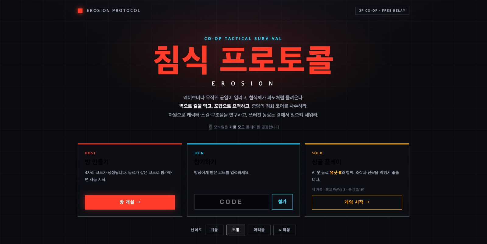
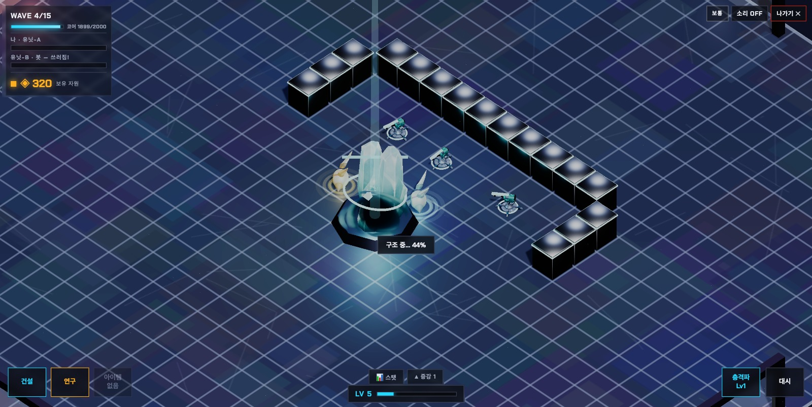
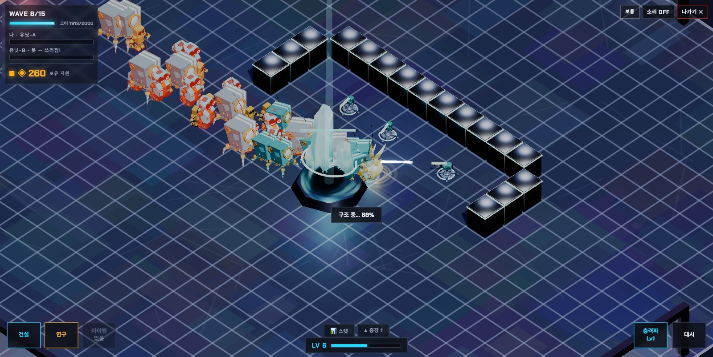
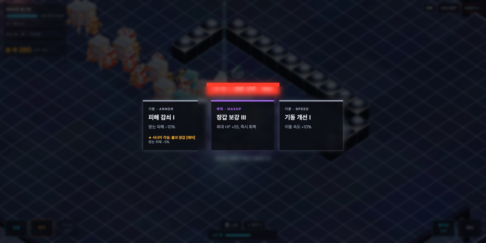
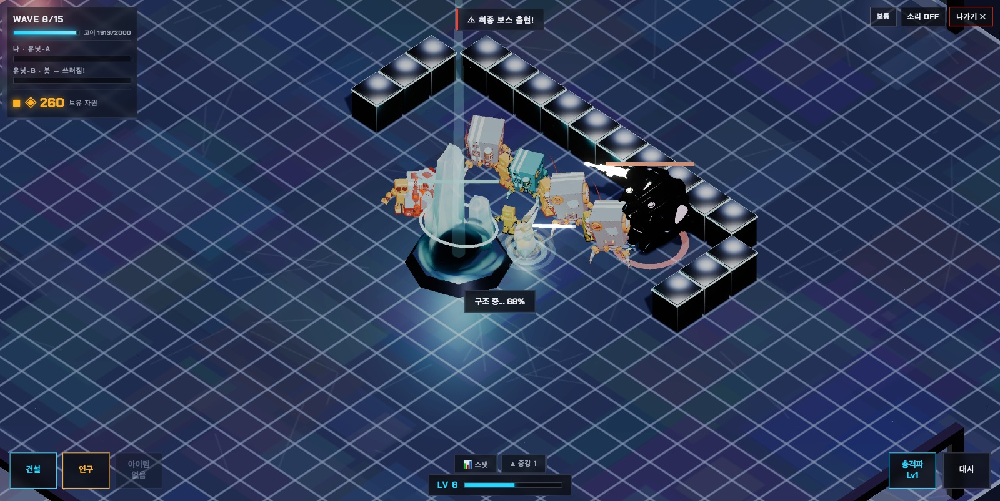
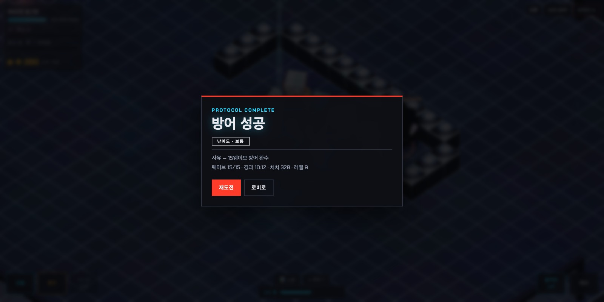

# 침식 프로토콜 — EROSION PROTOCOL

2인 협동 기지 방어 게임. three.js + 무료 MQTT 릴레이, 서버리스.

**플레이: https://q-erosion.pages.dev**

중앙 정화 코어를 지키며 사방 균열에서 쏟아지는 침식체를 벽·포탑으로 막고, 레벨업 증강(레어·에픽·시너지)으로 성장한다.

## 스크린샷

| | |
|:--:|:--:|
|  |  |
| **로비** — 방 개설·참가·싱글, 난이도 선택 | **준비 단계** — 벽·포탑으로 방어선 구축 |
|  |  |
| **습격** — 균열에서 쏟아지는 침식체 무리 | **강화 선택** — 레벨업마다 증강(레어·에픽·시너지) |
|  |  |
| **보스전** — 최종 보스 «침식의 근원» | **방어 성공** — 전투 기록 정산 |

## 문서

- [게임 가이드](docs/GAME_GUIDE.md) — 조작, 규칙, 적 유형, 시너지, 아이템
- [설계·정책 문서](docs/GAME_DESIGN.md) — 밸런스 수치, 웨이브/맵/네트워킹 정책

## 구조

| 경로 | 내용 |
|---|---|
| `index.html` | 로비 + 앱 셸 (PWA) |
| `src/main.js` | `<erosion-game>` 커스텀 엘리먼트 — 메인 루프·틱 |
| `src/world.js`, `waves.js`, `combat.js` | 맵·리셋 · 웨이브·스폰·게임오버 · 전투·총알·데미지 |
| `src/net.js` | 멀티플레이 — 전용 릴레이(WebSocket) + MQTT 폴백 |
| `src/scene.js`, `models.js`, `hud.js`, `sheets.js`, `input.js` | 3D 씬·모델 · HUD·시트 UI · 입력 |
| `src/util.js` | 상수·밸런스 수치·헬퍼 |
| `sw.js`, `manifest.webmanifest`, `icons/` | PWA |
| `relay/` | 전용 멀티플레이 릴레이 — Cloudflare Worker + Durable Object |
| `assets/` | OG 이미지·스크린샷 |
| `design/` | claude.ai/design 원본 시안 스냅샷 |
| `docs/` | 게임 가이드·설계 문서 |

## 개발 · 배포

```bash
python3 -m http.server 8791   # 로컬: http://localhost:8791
```

`development` 브랜치에서 작업 → `production` 대상 PR → 병합 시 GitHub Actions가 Cloudflare Pages로 자동 배포.
